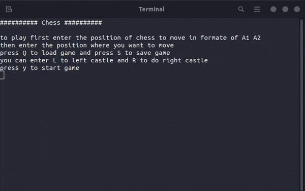

# Chess
Two player CLI Chess game in ruby
This is the part of The odin project( it is a little complex for me but I conquered it eventually)

## At glance it looks like below

## Things to add
 * feature to save and load game
 * AI computer player
